

Big data and visualization

    

Before the hands-on lab setup guide

November 2019

Information in this document, including URL and other Internet Web site references, is subject to change without notice. Unless otherwise noted, the example companies, organizations, products, domain names, e-mail addresses, logos, people, places, and events depicted herein are fictitious, and no association with any real company, organization, product, domain name, e-mail address, logo, person, place or event is intended or should be inferred. Complying with all applicable copyright laws is the responsibility of the user. Without limiting the rights under copyright, no part of this document may be reproduced, stored in or introduced into a retrieval system, or transmitted in any form or by any means (electronic, mechanical, photocopying, recording, or otherwise), or for any purpose, without the express written permission of Microsoft Corporation.

Microsoft may have patents, patent applications, trademarks, copyrights, or other intellectual property rights covering subject matter in this document. Except as expressly provided in any written license agreement from Microsoft, the furnishing of this document does not give you any license to these patents, trademarks, copyrights, or other intellectual property.

The names of manufacturers, products, or URLs are provided for informational purposes only and Microsoft makes no representations and warranties, either expressed, implied, or statutory, regarding these manufacturers or the use of the products with any Microsoft technologies. The inclusion of a manufacturer or product does not imply endorsement of Microsoft of the manufacturer or product. Links may be provided to third party sites. Such sites are not under the control of Microsoft and Microsoft is not responsible for the contents of any linked site or any link contained in a linked site, or any changes or updates to such sites. Microsoft is not responsible for webcasting or any other form of transmission received from any linked site. Microsoft is providing these links to you only as a convenience, and the inclusion of any link does not imply endorsement of Microsoft of the site or the products contained therein.

© 2019 Microsoft Corporation. All rights reserved.

Microsoft and the trademarks listed at <https://www.microsoft.com/en-us/legal/intellectualproperty/Trademarks/Usage/General.aspx> are trademarks of the Microsoft group of companies. All other trademarks are property of their respective owners.

This lab is based on Microsoft labs avaialble on [following website: ](https://github.com/microsoft/MCW-Big-data-and-visualization/tree/master/Hands-on%20lab)

**Contents**

<!-- TOC -->

- [Big data and visualization before the hands-on lab setup guide](#big-data-and-visualization-before-the-hands-on-lab-setup-guide)
  - [Requirements](#requirements)
  - [Before the hands-on lab](#before-the-hands-on-lab)
    - [Task 1: Redeem your Azure Pass](#task-1-redeem-your-azure-pass)
    - [Task 2: Provision Windows 10 VM](#task-2-provision-windows-10-vm)
    - [Task 3: Download and stage data to be processed](#task-3-download-and-stage-data-to-be-processed)
    - [Task 4: Install and configure Azure Data Factory Integration Runtime on your machine](#task-4-install-and-configure-azure-data-factory-integration-runtime-on-your-machine)
    - [Task 5: Download and install Power BI Desktop](#task-5-download-and-install-power-bi-desktop)

<!-- /TOC -->

# Big data and visualization before the hands-on lab setup guide

## Requirements

1.  Microsoft Azure subscription must be pay-as-you-go or MSDN.

    a. Trial subscriptions will not work.

2.  If you are not a Service Administrator or Co-administrator for the Azure subscription, or if you are running the lab in a hosted environment, you will need to install [Visual Studio 2019 Community](https://visualstudio.microsoft.com/downloads/) with the **ASP.NET and web development** and **Azure development** workloads.

## Before the hands-on lab

Duration: 30 minutes

In this exercise, you will set up your environment for use in the rest of the hands-on lab. You should follow all the steps provided in the Before the Hands-on Lab section to prepare your environment _before_ attending the hands-on lab.

### Task 1: Redeem your Azure Pass

1. Open web browser and go to [Microsoft Azure Pass](https://www.microsoftazurepass.com/) website, click on **Start**

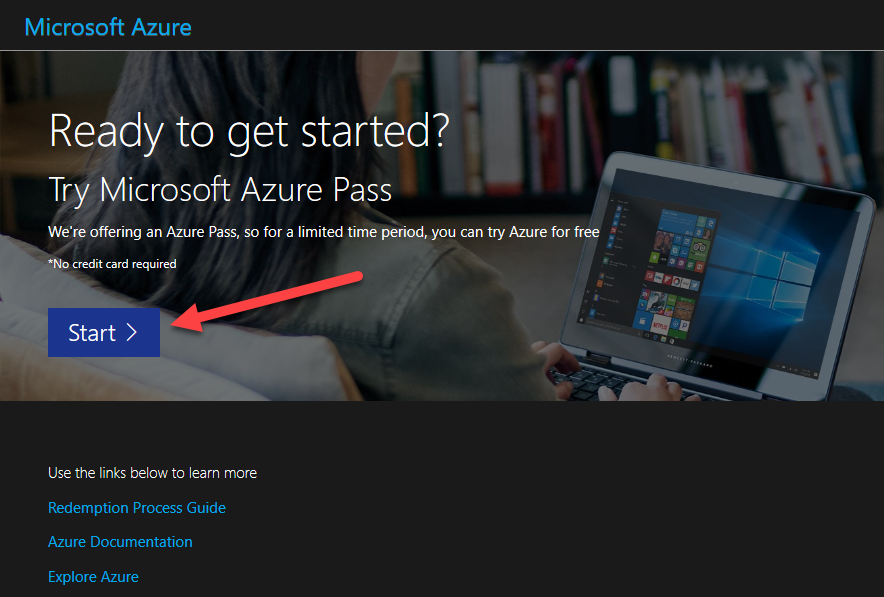

2. Check if account is correct and click on **Confirm Microsoft Account**

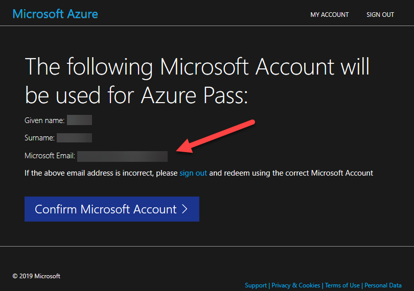

3. Provide Azure Pass and click on **Claim Promo Code**

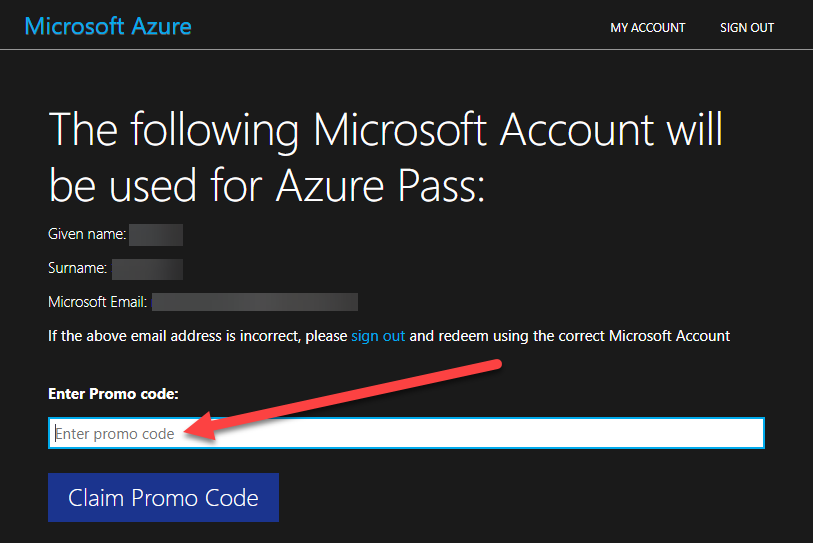

4. In the [Azure portal](https://portal.azure.com/), go to search and type **Subscriptions** and check if Azure Pass subscription is available:

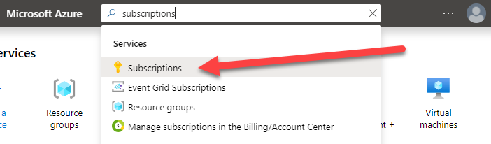

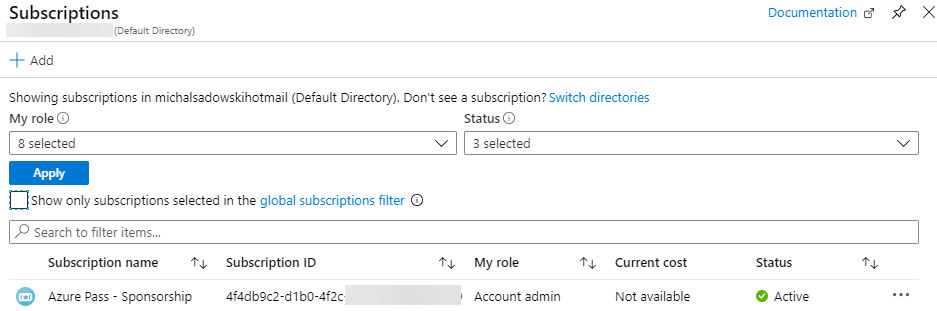

### Task 2: Provision Windows 10 VM

In this task, you will provision a virtual machine (VM) in Azure. The VM image used will have Visual Studio Community 2019 installed.

1. In the [Azure portal](https://portal.azure.com/), select **+Create a resource**, 

    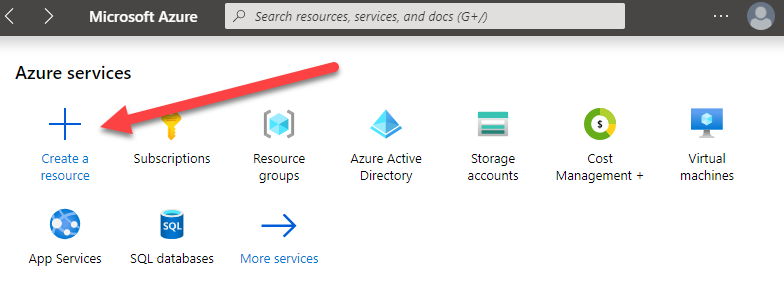

2. Enter "visual studio 2019" into the Search the Marketplace box, and then select **Visual Studio 2019 Latest** from the results.

	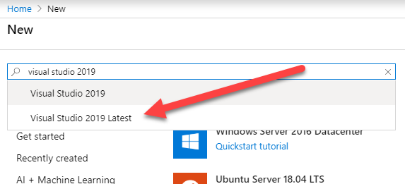

3. On the Visual Studio 2019 blade, select **Visual Studio 2019 Community (latest release) on Windows Server 2019 (x64)** from the Select a software plan drop down list and then select **Create**.

    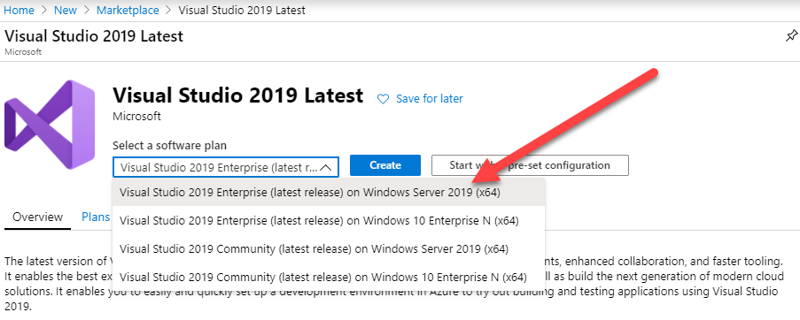

4. On the Create a virtual machine blade check if you are using Azure Pass subscription. Click on **Create new** Resource Group and proivde **Name** as **hands-on-lab**

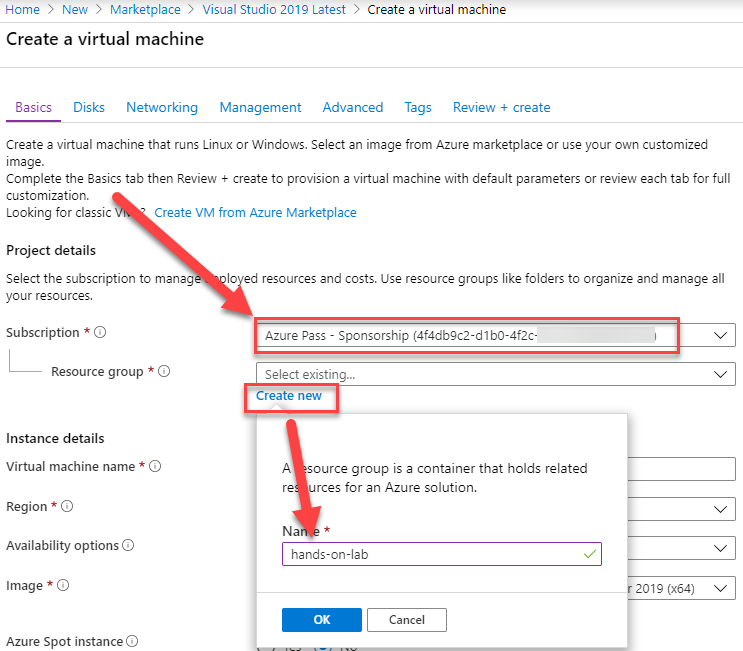

5. On the Create a virtual machine **Basics** tab, set the following configuration:

    - **Subscription**: Select the Azure Pass subscription.
    - **Resource Group**: Select the hands-on-lab resource group from the list of existing resource groups.
    - **Virtual machine name**: Enter JumpBox.
    - **Region**: Select the region you are using for resources in this hands-on lab. (Preferably **(Europe) North Europe**)
    - **Availability options**: Select no infrastructure redundancy required.
    - **Image**: Leave Visual Studio 2019 Community (latest release) on Windows Server 2019 (x64) selected.
    - **Size**: Select **Change size**, and select Standard D2 v3 from the list and then select **Accept**.
    - **Username**: Enter **mtadmin**
    - **Password**: Enter **Password.1234567890**
    - **Public inbound ports**: Choose Allow selected ports.
    - **Select inbound ports**: Select RDP (3389) in the list.

    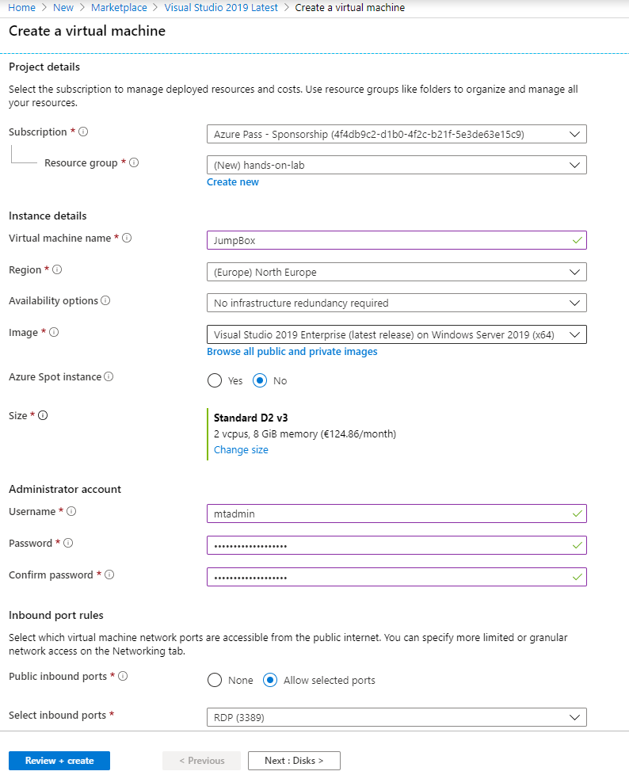

6. Select **Review + create** to validate the configuration.

7. On the **Review + create** tab, ensure the Validation passed message is displayed, and then select **Create** to provision the virtual machine.

    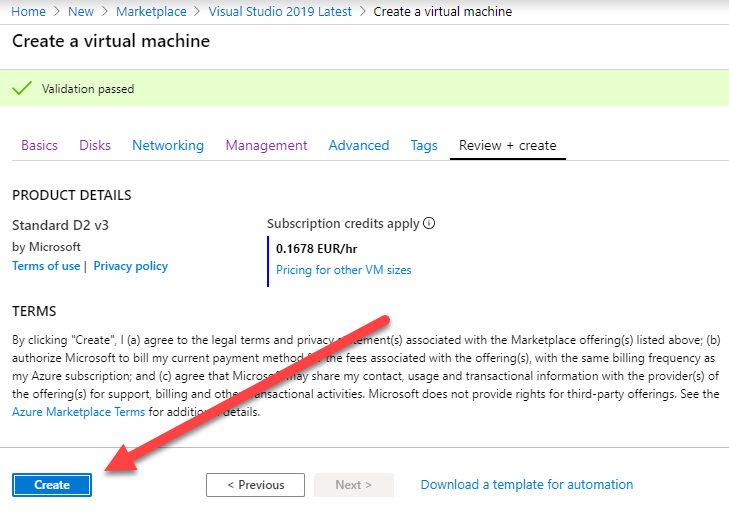

9. It will take approximately 5 minutes for the VM to finish provisioning. You can move on to the next task while you wait.

### Task 3: Download and stage data to be processed

1. Go to [Azure Portal](https://portal.azure.com) -> **hands-on-lab** resource group and click on **JumpBox** Virtual Machine

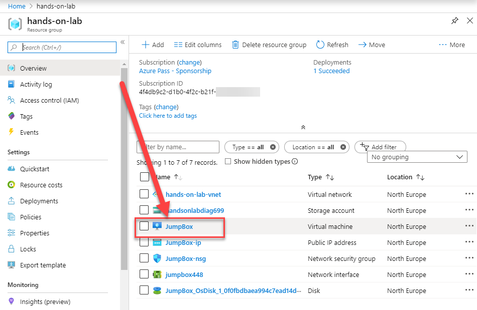

2. Check if machine is in state **Running** and connect VM using RDP

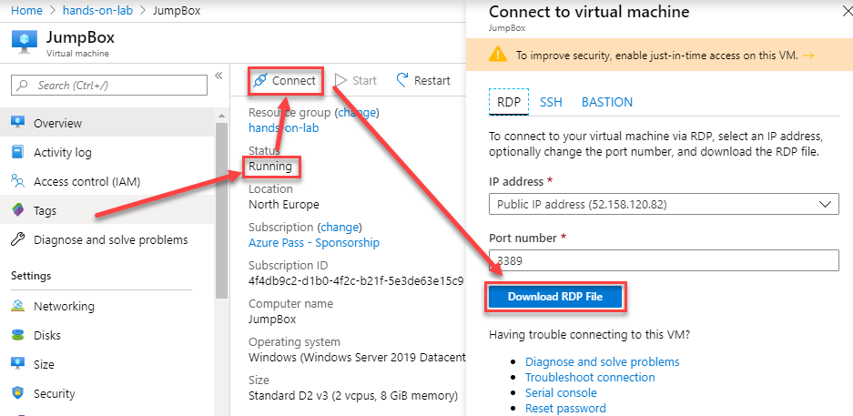

3. Select **Connect** on the Remote Desktop Connection dialog.

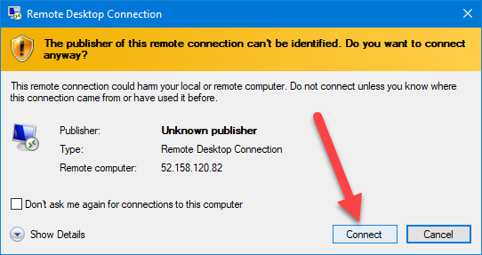

4. Enter the following credentials when prompted, and then select **OK**:

    - **User name**: mtadmin
    - **Password**: Password.1234567890 

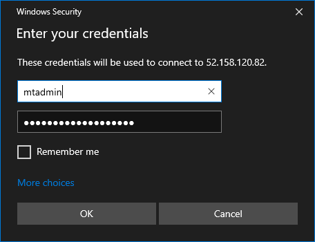

5. Select **Yes** to connect, if prompted that the identity of the remote computer cannot be verified.

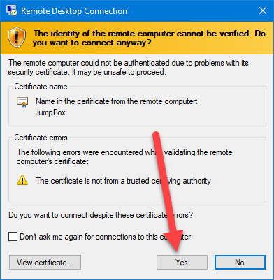

6. Run Internet Explorer and click **OK** on Set up Internet Explorer 11

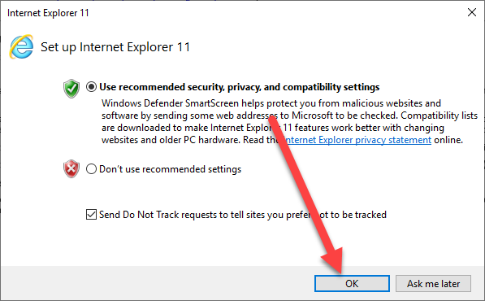

7. Download the AdventureWorks sample data from <http://bit.ly/2zi4Sqa>.

8. Extract it to a new folder called **C:\\Data**.

### Task 4: Install and configure Azure Data Factory Integration Runtime on your machine

1. To download the latest version of Azure Data Factory Integration Runtime, go to <https://www.microsoft.com/en-us/download/details.aspx?id=39717>.

   

2. Select Download, then choose the download you want from the next screen.

   

3. Run the installer, once downloaded.

4. When you see the following screen, select Next.

   

5. Check the box to accept the terms and select Next.

   

6. Accept the default Destination Folder, and select Next.

   

7. Choose Install to complete the installation.

   

8. Select Finish once the installation has completed.

   

9. After selecting Finish, the following screen will appear. Keep it open for now. You will come back to this screen once the Data Factory in Azure has been provisioned, and obtain the gateway key so we can connect Data Factory to this "on-premises" server.

   

### Task 5: Download and install Power BI Desktop

Power BI desktop is required to make a connection to your Azure Databricks environment when creating the Power BI dashboard.

1. To download the latest version of Power BI Desktop, go to[Power BI Desktop](https://powerbi.microsoft.com/desktop/). and select **See Download or Lanugage Options**

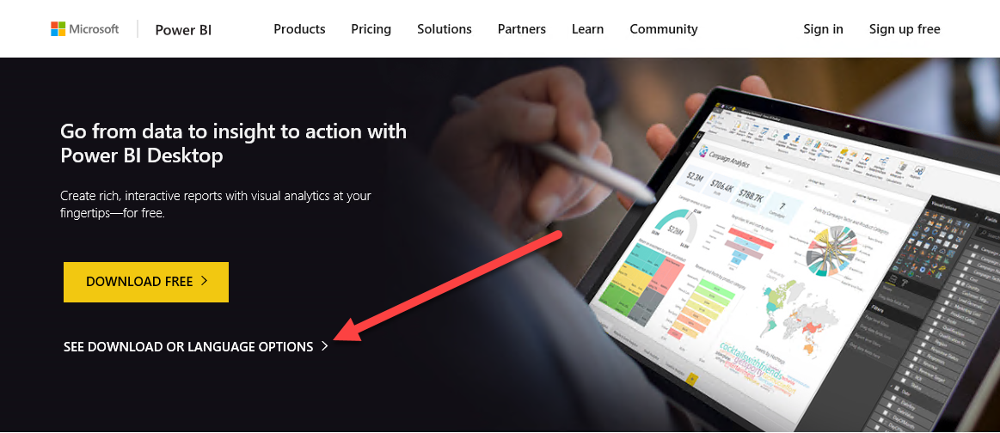

2. Choose the download you want from the next screen.

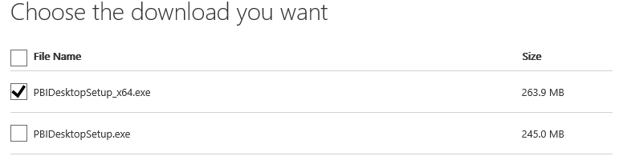

3. Run the installer, once downloaded.

4. On Welcome screen, select English and click Next.

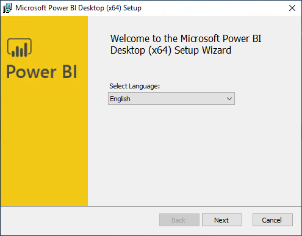

4. When you see the following screen, select Next.

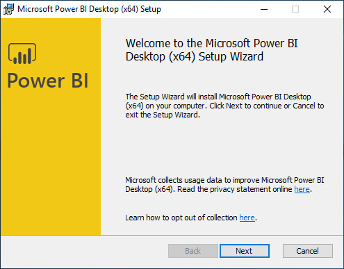

5. Check the box to accept the terms and select Next.

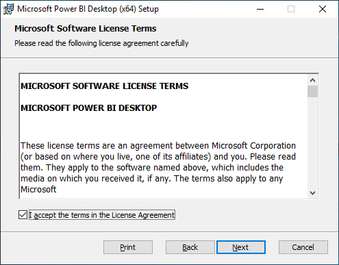

6. Accept the default Destination Folder, and select Next.

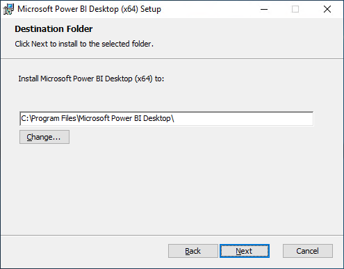

7. Choose Install to complete the installation.

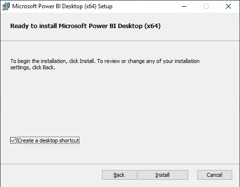

8. Select Finish once the installation has completed.

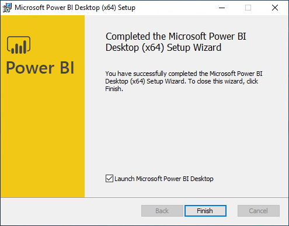

You should follow all these steps provided _before_ attending the Hands-on lab.
